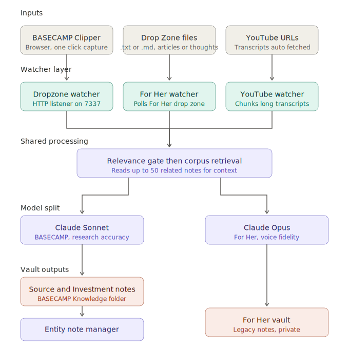

# Second Brain

A personal knowledge management system built on Obsidian, markdown, and the Claude API.

**Author:** Andrew Parmentier
**Last updated:** April 2026

This repo documents the architecture and automation layer behind a two-sided Obsidian vault I've been building. One side is a professional research engine for tracking investments, companies, and sectors. The other is a private library of thoughts I'm writing for my daughter. The same infrastructure powers both.

---

## The Two Vaults

### BASECAMP — Professional Research Infrastructure

BASECAMP is my operating system for investment research, frameworks, and reference material. Wall Street research, earnings call notes, articles, podcasts, YouTube interviews, and original thoughts flow through automated pipelines and land in the vault as structured notes — tagged, cross-linked, and queryable. Every new source updates a longitudinal dossier for any company it mentions, with a directional signal and conviction level assigned by Claude.

### For Her — Legacy Documentation

The second vault has no public name. It's a structured collection of notes I'm writing for my daughter: my values, my opinions on money, relationships, faith, resilience, career decisions, and the things I wish someone had told me. The goal is that long after I'm gone, she'll have a searchable, queryable library of how I thought about the things that mattered.

The content of that vault is private. The infrastructure it runs on is identical to BASECAMP — which is why I'm publishing the architecture.

---

## The Core Insight: Notes Are a Dataset

Most people who take notes are building an archive. This system is built around a different premise: **every note is a document in a machine-readable corpus.**

Every note is saved as a plain `.md` file. Markdown is the lingua franca of AI systems — a folder of `.md` files can be fed directly into Claude, GPT, or any future system without conversion, scraping, or reformatting. When I write a note, I'm adding a structured document to a dataset that an AI will eventually query.

That reframe changes how you write. You stop thinking like a journaler and start thinking like a corpus architect — building toward a specific outcome.

---

## The Three-Level Knowledge Base

Earlier versions of this system produced one flat note per source. That doesn't scale. The current architecture is three layers:

| Layer | Purpose | What it looks like |
|---|---|---|
| **Source Note** | Raw archive of the input | The original article, transcript, or thought, preserved verbatim with metadata |
| **Investment Note** | Per-source decision-focused take | What this source means for a specific thesis or company — the angle, not the summary |
| **Entity Note** | Longitudinal dossier per company | A single evolving file per ticker: all related sources, all investment notes, a Claude-generated synthesis, a directional signal, and a conviction level |

When a new source lands in the Drop Zone, the automation creates the Source Note and the Investment Note, then updates every relevant Entity Note in the vault. A year of research compounds into a queryable company-level view without manual stitching.

**Current scale:** 41 Entity Notes across 25 sectors, 39 Source Notes, 20 Investment Notes.

---

## Entity Notes — The Atomic Unit of Research

Each Entity Note is one markdown file with a strict frontmatter schema:
```yaml
---
title: Palo Alto Networks
ticker: PANW
type: entity
updated: 2026-04-06
sector: cybersecurity
peers: [CRWD, FTNT, ZS]
themes: [enterprise-security, zero-trust, ai-defense]
signal: HOLD
conviction: MEDIUM
---
```

The `signal` and `conviction` fields are auto-generated on every update by Claude based on gate criteria I specify. Conviction runs on a dual-gate system — an evidence floor (1-2 sources = LOW, 3-5 = MEDIUM, 6+ = HIGH) combined with a quality assessment within that floor. Conviction can never exceed the evidence floor regardless of source quality. This is deliberate: high conviction with thin evidence is how investors get hurt.

The body of each Entity Note contains an Evidence Log (a table of every source that touches this company), a Claude-regenerated Synthesis (the current view), and a manual Watch section for open questions.

---

## The Drop Zone — Eliminating Capture Friction

The most important piece of the system is the Drop Zone — a watched folder that eliminates the gap between finding something worth saving and having a useful note.

**Old workflow:** Paste article into Claude → copy markdown output → open Obsidian → create note → paste → title it → tag it. About 90 seconds and four context switches.

**New workflow:** Click one button in the browser. Or drop a text file into `01-Drop Zone/`. Done.

What happens automatically, in sequence:

1. A Python watcher running as a macOS LaunchAgent detects the new file
2. The watcher reads up to 50 related notes from the existing corpus to build context
3. Full content goes to the Claude API with a structured prompt that includes the corpus context
4. Claude generates the Source Note and the Investment Note
5. Both notes save into the vault with proper frontmatter and wikilinks
6. Any Entity Notes for mentioned tickers are updated with a new Evidence Log entry, fresh Synthesis, and re-evaluated signal and conviction
7. The source file moves to `_processed/`

Total elapsed time: approximately 30 seconds. Zero manual steps after the drop.

The same pipeline handles articles, YouTube videos (transcripts fetched via `youtube-transcript-api`, chunked and synthesized for videos over 60 minutes), and raw thoughts typed into a text file. Dedicated watchers exist for BASECAMP professional content and the For Her legacy vault, each using a different Claude model tuned for the work: Sonnet for research accuracy, Opus for voice fidelity.

---

## BASECAMP Clipper

A companion Chrome extension that turns any webpage into a one-click drop. `⌘⇧S` captures the page, extracts the readable content, detects relevant tickers, and sends it to the watcher's local HTTP listener. Two seconds from article to pipeline.

---

## System Architecture



See `ARCHITECTURE.md` for a deeper walkthrough of the data flow, watcher internals, and Entity Note update logic.

---

## Why Markdown

Most knowledge lives in proprietary formats — Notion, Evernote, Apple Notes. Those formats are locked. If the company shuts down, changes pricing, or loses relevance, your data is degraded or trapped.

Markdown is a 30-year-old open standard. It will be readable by any tool that exists in 5, 10, or 20 years. Every serious AI system today processes it natively. Choosing markdown is a long-term infrastructure decision, not a formatting preference.

---

## Current Status (April 2026)

**Live and running:**

- Four automated watchers running as macOS LaunchAgents (BASECAMP Drop Zone, YouTube, For Her, StockTwits ingester)
- BASECAMP Clipper Chrome extension with HTTP bridge to local watcher
- Three-level knowledge base: 41 Entity Notes, 39 Source Notes, 20 Investment Notes
- Automated Entity Note updates with dual-gate signal and conviction
- Rollup generator producing a sector-grouped view of the full KB
- kepano/obsidian-skills integrated at the Claude Code level for vault-native output

**Shipping next:**

- Automated daily brief generator (morning cycle with session bias from TradingView MCP)
- TradingView MCP integration for real-time chart reading inside Claude Code
- Content radar — morning brief pulled from the past 24 hours of high-signal sources
- Stock research framework ported to Claude Code slash commands

---

## Repo Contents
second-brain/
├── README.md                    ← you are here
├── ARCHITECTURE.md              ← technical overview of how the pieces fit together
├── CHANGELOG.md                 ← version history
├── architecture-diagram.svg     ← system data flow visual
├── dropzone_watcher.py          ← the core automation script
├── test_dropzone_watcher.py     ← test suite (being updated against the current watcher)
└── .gitignore

---

## About

Andrew Parmentier is a Wall Street research principal with 20+ years in financial services. He co-founded Height Capital Markets, ran strategy at Highland Capital Management, and earlier in his career served on the House Financial Services Committee staff during the drafting of Gramm-Leach-Bliley.

Questions or feedback: [github.com/andrewparmentier](https://github.com/andrewparmentier)
